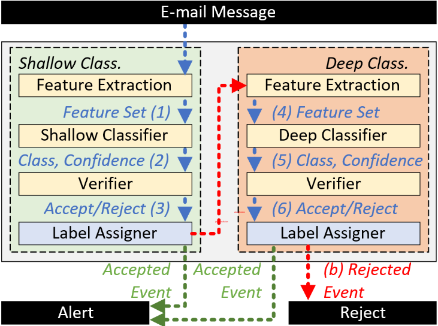

# Towards a Reliable Spam Detection: An Ensemble classification with rejection option
## Authors: Cleber Olivo and Altair O. Santin and Eduardo K. Viegas and Jhonatan Geremias and Eduardo Souto 
Numerous challenges arise within the email ecosystem as a result of spam, including bottlenecks occurring in email gateways. Despite substantial investments in server infrastructure, challenges persist, such as wasted computational resources and ineffective detection, frequently caused by the ongoing demand for periodic updates to spam detection model algorithms. In light of this, this paper proposes a reliable spam detection model designed to address the dynamic nature of spam messages, which exhibit non-stationary behavior over time. The proposed model is implemented in two phases. Initially, a high detection rate is achieved through a shallow classifier that selectively accepts only reliably classified spam messages. Second, unreliable classifications are discarded and routed to a deep learning classifier, ensuring both reliability and a high throughput in detection. Experiments conducted on a novel dataset comprising over 1.8 million real and valid spam messages accumulated over a decade demonstrate several key findings: (i) the model’s reliability improves over time, (ii) it autonomously identifies outdated models without human intervention, and (iii) it maintains a high classification throughput rate.

### Keywords: Spam detection, deep learning, ensemble classifier with rejection option, classification reliability, classification throughput.

## Proposal




## Dataset
<ul>
  <li><a href="https://secplab.ppgia.pucpr.br/dsdspam"> DSD dataset</a></li> 
</ul>

## BibTeX

```bibtex
@inproceedings{geremias2022motion,
  title={A motion-based approach for real-time detection of pornographic content in videos},
  author={Geremias, Jhonatan and Viegas, Eduardo K and Britto Jr, Alceu S and Santin, Altair O},
  booktitle={Proceedings of the 37th ACM/SIGAPP Symposium on Applied Computing},
  pages={1066--1073},
  year={2022}
}
```
